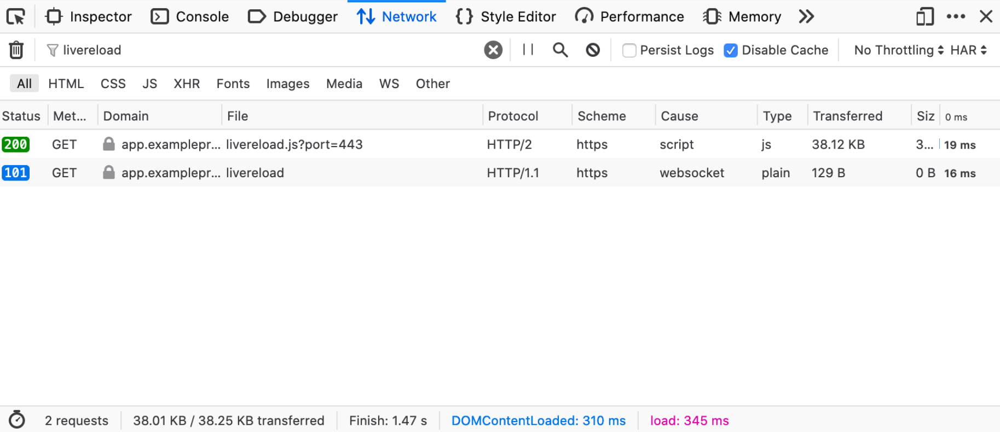

# Grunt and LiveReload Setup

LiveReload routing is currently supported only on the `magento2` environment type. Other environment types may utilize LiveReload via per-project compose configurations to setup the routing for LiveReload JS and WebSocket endpoints.

## Configuration for Magento 2

Magento 2 bundles an example grunt based server-side compilation workflow which includes LiveReload and it works within the RollDev shell environment. In order to use this:

1. Rename or copy `Gruntfile.js.sample` file to `Gruntfile.js` in your project root.

2. Rename or copy `package.json.sample` file to `package.json` in your project root.

   :::{note}
   If you are running your dev environment on a Mac with Apple Silicon, you may encounter a compatibility issue in the next
   step. Before moving on to `npm install`, find the line for the package `grunt-contrib-jasmine` in `package.json` and
   remove it.
   :::

3. Run `npm install` to install the required NodeJS packages as defined in `package.json`.

4. Merge the following into your project's `app/etc/env.php` configuration file:

   ```php
   <?php
   return [
       'system' => [
           'default' => [
               'design' => [
                   'footer' => [
                       'absolute_footer' => '<script defer src="/livereload.js?port=443"></script>'
                   ]
               ]
           ]
       ]
   ];
   ```

   :::{note}
   This can be accomplished via alternative means, the important part is the browser requesting ``/livereload.js?port=443`` when running the site on your local development environment.
   :::

5. Run `bin/magento app:config:import` to load merged configuration into the application.

**With the above configuration in place**, you'll first enter the FPM container via `roll shell` and then setup as follows:

1. Clean and build the project theme using grunt:

   ```shell
   grunt clean
   grunt exec:blank
   grunt less:blank
   ```

2. Thereafter, only a single command should be needed for daily development:

   ```shell
   grunt watch
   ```

   :::{note}
   Grunt should be used within the php-fpm container entered via ``roll shell``
   :::

This setup will also be used to persist changes to your compiled CSS. When you run `grunt watch`, a LiveReload server will be started on ports 35729 within the php-fpm container and Traefik will take care of proxying the JavaScript tag and WebSocket requests to this listener.

On a working setup with `grunt watch` running within `roll shell` you should see something like the following in the network inspector after reloading the project in a web browser.


